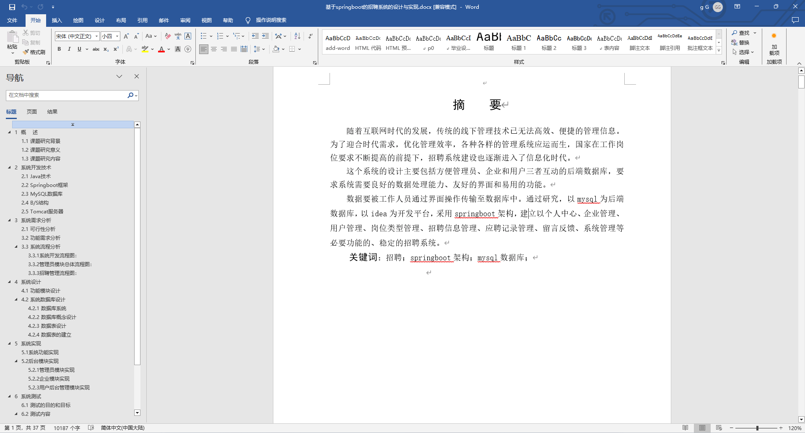
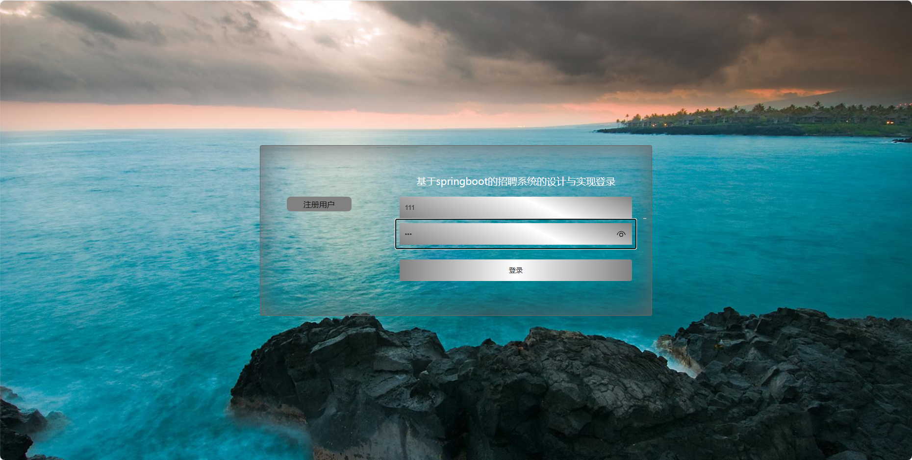
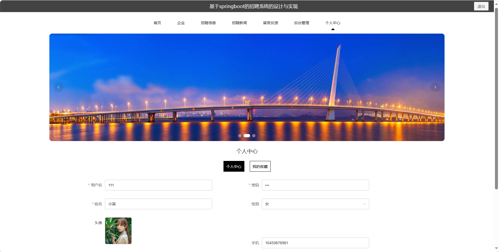
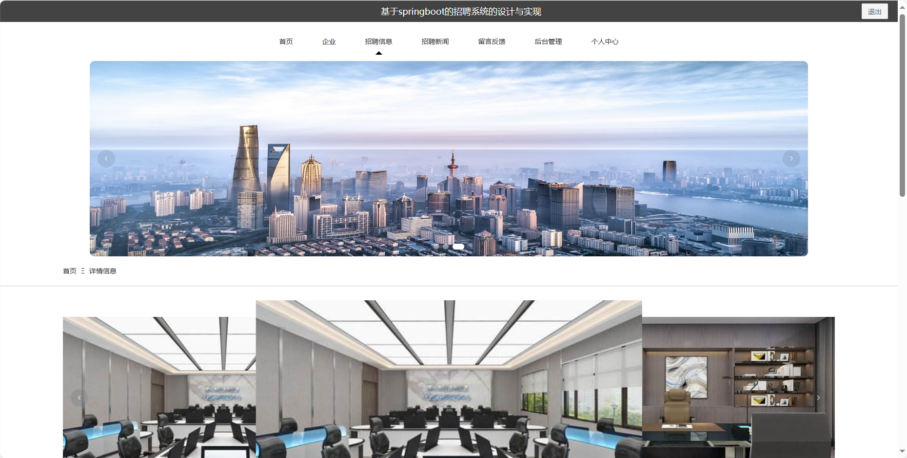
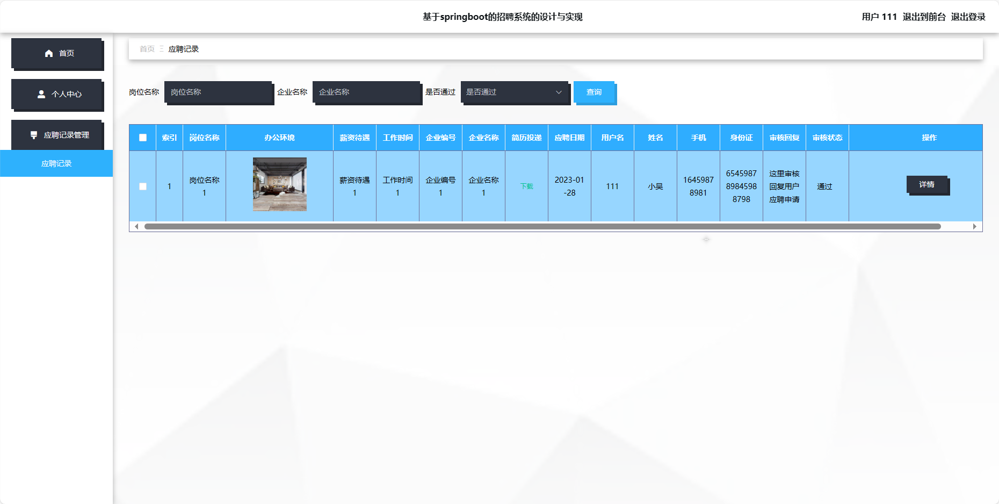
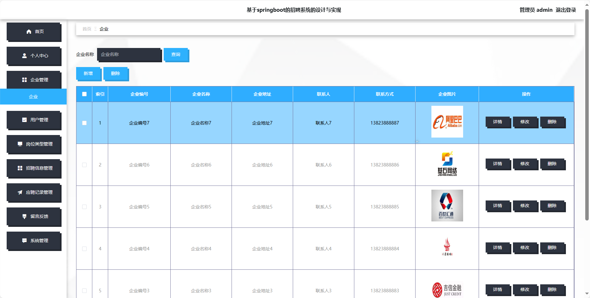
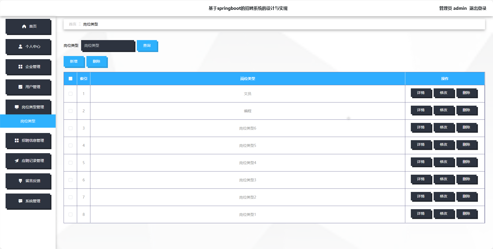
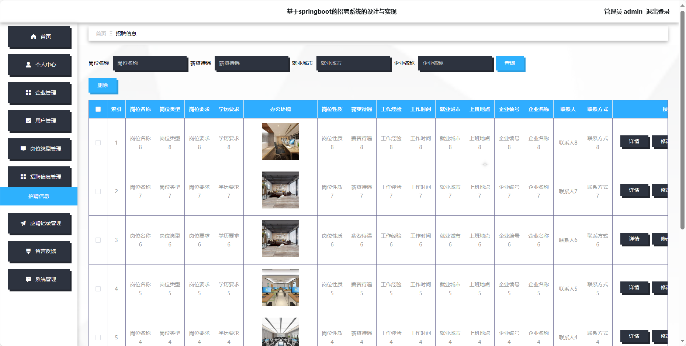

## 基于SpringBoot的招聘系统(程序+报告)

###  获取sql数据库文件: 从戎源码网 (https://armycodes.com/) QQ: 386869957 QQ群: 377586148
###  所有系统地址: (https://github.com/YuLin-Coder/AllProjectCatalog) 
###  所有项目以及源代码本人均调试运行无问题 可支持远程安装部署调试、定制修改、代码讲解

## 项目介绍
基于SpringBoot的招聘系统，系统包含三种角色：管理员、用户,企业主要功能如下。

### 【管理员】:
1. 首页：查看系统概况和重要信息。
2. 个人中心：管理管理员个人信息。
3. 企业管理：编辑和管理企业的基本信息。
4. 用户管理：管理系统用户的账户信息。
5. 岗位类型管理：维护招聘岗位的分类信息。
6. 招聘信息管理：发布、编辑和管理招聘信息。
7. 应聘记录管理：查看和管理用户的应聘记录。
8. 留言反馈：查看和处理用户的留言反馈。
9. 系统管理：进行系统的基本设置。

### 【用户】:
1. 首页：浏览系统主要信息和最新动态。
2. 企业：查看不同企业的基本信息。
3. 招聘信息：浏览企业发布的招聘信息。
4. 招聘新闻：阅读与招聘相关的新闻资讯。
5. 留言反馈：提供对企业的反馈和建议。
6. 后台管理：进入用户的后台管理界面，包括编辑个人信息、查看应聘记录等功能。
7. 个人中心：管理个人信息。

### 【企业】:
1. 首页：浏览企业的主要信息和最新动态。
2. 个人中心：管理企业个人信息。
3. 岗位类型管理：维护招聘岗位的分类信息。
4. 招聘信息管理：发布、编辑和管理招聘信息。
5. 应聘记录管理：查看和管理用户的应聘记录。

## 项目技术
- 编程语言：Java
- 数据库：MySQL
- 项目管理工具：Maven
- 前端技术：HTML、CSS、JavaScript、Jquery、Vue
- 后端技术：Spring、SpringMVC、MyBatis

## 运行环境
- JDK版本：JDK1.8及以上
- 开发工具：IDEA、Ecplise、Myecplise都可以
- 数据库: MySQL5.7及以上
- Maven：maven3.0及以上
- Node：14.14.0及以上

## 运行截图

